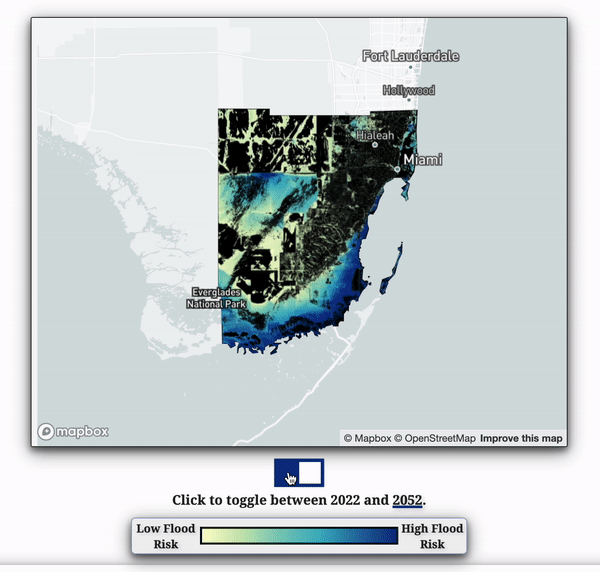
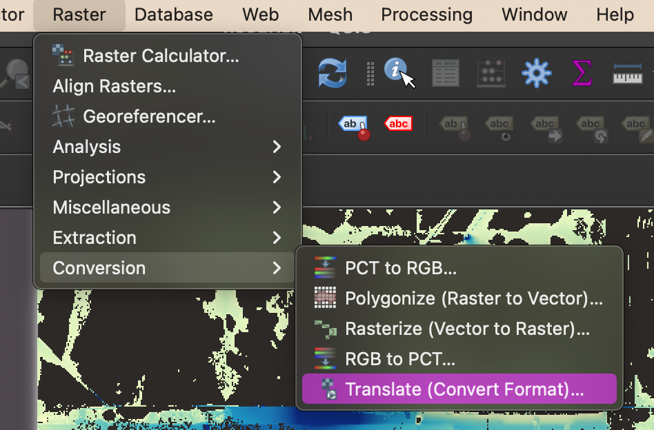
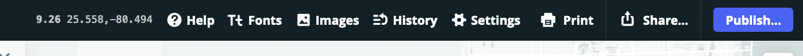

# Mapping and styling geoTIFFs for the web: how was the Miami-Dade flood risk map made? 

## Table of Contents

- [Overview](#overview)
- [Data sources](#data-sources)
- [Working with geoTIFF Files in QGIS](#working-with-geotiff-files-in-qgis)
- [Uploading geoTIFFs to Mapbox as Tilesets](#uploading-geotiffs-to-mapbox-as-tilesets)
- [Using Mapbox Studio to Create a Style Layer](#using-mapbox-studio-to-create-a-style-layer)
- [Creating a Custom Web Map with Mapbox GL JS](#creating-a-custom-map-with-mapbox-gl-js)
- [Addendum: Help Me Make This Map More Accessible](#addendum-help-me-make-this-map-accessible)
---

## Overview  

I created the interactive Miami-Dade County flood map seen below for [this]() story by [Alex Harris]() in the Miami Herald. It depicts the water depth that each three-meter pixel has the chance of getting within a 5% probability. The map is designed to compare different areas of Miami-Dade County, along with the current projection with the future projection. For that reason, the raw values (originally in centimeters) have been exluded from the map, and the visualization is based on a color gradient scheme.  



Click [here](https://coxco96.github.io/miami-floods/) for the github.io demonstration of this map.


This walkthrough assumes beginner-level HTML/CSS/JavaScript knowledge.

---

## Data Sources/Attribution

- I received the flood data for this map in the form of geoTIFF files via email from [First Street Foundation](https://firststreet.org/). You can find First Street Foundation's full flood-related datasets [here](https://livingatlas.arcgis.com/en/browse/?q=%22First%20Street%22#d=2&q=%22First%20Street%22&type=layers&srt=name). Explore all public data from the foundation [here](https://firststreet.org/data-access/public-access/).

- [Shapefile: TIGER/LINE format on the U.S. county level](https://www.census.gov/geographies/mapping-files/time-series/geo/tiger-line-file.html)

---

## Working with geoTIFF Files in QGIS

1. [Upload geoTIFFs to QGIS](#upload-geotiffs-to-qgis)  
2. [Add a shapefile](#add-a-shapefile)
3. [Convert bands to 8-bit](#convert-bands-to-8-bit)
4. [Style raster bands](#style-raster-bands)
5. [Export geoTIFFs](#export-geotiffs)


### **Upload geoTIFFs to QGIS**

- If you don't already have it installed, download and install the long-term release (LTR) version of [QGIS](https://qgis.org/en/site/forusers/download.html).
- Within QGIS, we're going to upload your geoTIFF file as a raster layer. If your data file ends in .tif or .tiff, you're looking at the right thing, so long as it contains geo information.
- From the top navigation bar in QGIS, click *Layer > Add layer > Add Raster Layer*. 


- Find the file source within your computer and upload. The layer should now appear in your layers panel.

### **Add a shapefile**

- Your shapefile should be in a *zip* file. From your device's file navigation, you can drag the *zip* file into the QGIS layers panel. Alternatively, use *Layer > Add Layer > Add Vector Layer*.

- Filter your shapefile to your area of interest. You may need to inspect the attribute table to figure out the best way to filter. View the attribute table by right-clicking the layer from the layers panel and select *Open Attribute Table*.

- Once you know how you want to filter your file, right-click the layer again, and click *Filter*, and write your expression. For example, if I wanted to see only Florida within my U.S. file, I would type *"STATE_FP" = '12'*. Be sure to use double quotation marks on the attribute name and single quotation marks on the attribute value.

- A new, temporary layer should be generated of your file. Hide your old file from the map by unchecking it. Save your new file by right-clicking and selecting *Export > Save Feature As*.

- When saving your new file, keep the format as Shapefile, and set your CRS. Select *EPSG:4326 - WGS 84* since we'll be moving the file to Mapbox.

### **Convert bands to 8-bit**

- We're going to upload our raster file to Mapbox. But in order to meet Mapbox's requirements, we must convert our geoTIFF to an 8-bit file.
- From the top navigation bar, click *Raster > Conversion > Translate (Convert Format)*.



- Select your raster file as the *Input layer*.

- Change *Output data type* to *Byte*.

- Leave other settings unchanged. Click *Run*. The new layer should now appear as a temporary layer on your layer panel. You may wish to rename your layers in a way that will assure you remember which one is which.

- Save your new file by right-clicking it in the layers panel and selecting *Export > Save Feature As*.

- When saving your new file, keep the file format as *geoTIFF* and select *EPSG:4326 - WGS 84* for the CRS since we'll be moving the file to Mapbox.

### **Style raster bands**

- Note that these instructions are specific to the data I worked with. They are a good starting point, but you may have to play around with settings and options for your data styling.

- Right-click your 8-bit raster layer. Select *Properties*. Click into the *Symbology* tab.

- Set *Rendering type* to *Singleband pseudocolor*.

- Set your color ramps, number of color stops, min/max values, etc. as you want your data to appear. Finding a good color gradient for your map can be one of the lengthiest parts of this process. Be sure to keep color accessibility in mind. [Colorbrewer](https://colorbrewer2.org/#type=sequential&scheme=BuGn&n=3) is a great resource for finding accessible color schemes for maps.

### **Export geoTIFFs**

- Right-click your 8-bit, colorized raster file from the layers panel. Select *Export > Save Feature As*.

- Select *Rendered Image* as your output mode. This is important. Further steps will not work if you do not save a rendered image of your data to your computer. 

- Save the file.

---

## Uploading geoTIFFs to Mapbox as Tilesets

1. [What is Mapbox, anyway?](#what-is-mapbox-anyway)
2. [Use Mapbox's API to upload large files](#use-mapboxs-api-to-upload-large-files)

### **What is Mapbox, anyway?**

- We're going to be using Mapbox Studio and Mapbox GL JS, which are two separate tools that work well together. Mapbox Studio is a no-code web mapping service. Some people think of it as the Photoshop of web mapping. It powers much of the maps you see on the web, and allows anyone to create custom, stylish maps that are easy to embed in applications or websites. It has some limitations, though, and that's where Mapbox GL JS comes in. GL JS requires some JavaScript knowledge, but it allows us to add some built-in UI features and, really, just about any kind of interactivity that you can code. We're going to keep things fairly simple. We'll add our raster layer with GL JS. Though you can add the layer within Mapbox Studio, doing it in GL JS allows for interactivity, such as the toggle button on the Miami map between the two different years. Explore the GL JS documentation to see what else you can do.

- Now, [create a Mapbox account](https://www.mapbox.com/mapbox-studio) if you don't already have one.

### **Use Mapbox's API to upload large files**

- If our file size were under 300 MB, we could upload our raster file directly within Mapbox Studio. Unfortunately, our rendered images probably are bigger. Check your file size to see. For context, my Miami-Dade files were over 2 GB each. If it's larger than 300 MB, you'll need to use Mapbox's API to upload the file through your system's terminal.

- If you're not much of a command-line user, this process can feel daunting. Mapbox has a clear tutorial for this, which I followed exactly. [Follow this tutorial, and come back once you have your raster file uploaded as tilesets onto Mapbox's server.](https://docs.mapbox.com/help/tutorials/upload-curl/)


---

## Using Mapbox Studio to Create a Style Layer

1. [Create a base layer for your map](#create-a-base-layer-for-your-map)
2. [Publish base map](#publish-base-map)

### **Create a base layer for your map**

- Open Mapbox Studio, and click *Get started*.

- Click *Create a map in Studio*.


- In the top right corner, click *tilesets*. You should see the raster image you just uploaded with the API. Click the three dots beside the tileset to see your tileset ID. Go ahead and copy the tileset ID and save it somewhere for later. We'll come back to it.

- Now, in the top right corner, click *Styles*, and then *New style*.

- Choose a style template (or build your own). For journalists, I recommend keeping it simple with *monochrome: light* or *monochrome: dark*.

- Once you're in the the studio, feel free to play around with layers, components and colors. Mapbox has lots of good tutorials on styling maps in the studio. This map is going to be your base map, meaning, the raster image you created in QGIS is going to sit on top of this map at its respective geolocation.

- Now let's add our shapefile from earlier. This is optional, but if your data has any holes within it, I recommend doing this. In the Miami-Dade map, I added a black shapefile of the county, which sits underneath my colored data.

- Advanced tip: to make a box-shadow blur effect on your county layer, copy the layer, but this change its data type from *polygon* to *line*. Leave both layer copies on the map. Change the color of the line. Increase the width and blur.

- We want to ultimately add our raster layer later with Mapbox GL JS. However, you can easily preview how it will look by adding it now. In the layers panel, click the plus sign, and select the file you just uploaded as your data source.

- You can adjust the arrangement of the layers by dragging and dropping layers in the layers panel.

- If you added your raster file, go ahead and hide it now, so we don't see it in our published map. Do this by  clicking it in the layers panel and then clicking the eyeball icon at the top of the panel.

### **Publish base map**

- Once you're satisfied with the look of your base map, we're going to publish it so we can work with it outside of Mapbox Studio.

- In the top right corner, click *Publish* > *Publish*.

- Now click *Share* (also in the top right corner). Scroll until you see *Developer resources*. Copy down the style URL and the access token. Paste them somewhere you can come back to.

- **Important note:** Use the *public* access token you get following the steps above. Do **not** use the secret access token you generated for the Uploads API earlier.

- In Mapbox Studio, move your map to the view you want it to load on in your story/webpage/application. In the top navigation bar, you'll see three numbers. The first is your *zoom level*, and the other two are your *center coordinates*. Copy these numbers down and save them for later.



---

## Creating a Custom Map with Mapbox GL JS

1. [Initalize map](#initialize-map)
2. [Add flood layer](#add-flood-layer)
3. [Go forth, and customize your map](#go-forth-and-customize-your-map)


### **Initialize map**

- Set up an HTML file. We'll use HTML, CSS, and JavaScript. Keep it all in one HTML file, or link your CSS and JS files. 

- In the HTML body, add a div for your map, like so:  

`<div id="map"></div>`

- In your CSS styling, add a box for your map to live in, like so:

```css
#map {
    border-style: solid;
    border-width: .1em;
    align-self: center;
    width: 80%;
    margin: 2% auto 1%;
    box-shadow: 0 4px 8px 0 rgba(0, 0, 0, 0.471), 0 6px 20px 0 rgba(0, 0, 0, 0.509);
    border-radius: 2px;
}
```

- From your JS file or script section, we're going to inject the Mapbox Studio base map into our map div:

```js
// get access
mapboxgl.accessToken = 'PASTE_YOUR_ACCESS_TOKEN_INSIDE_THESE_QUOTES';
// create a map variable with our base map
const map = new mapboxgl.Map({
    // put the 'map' inside the map div we made in HTML:
    container: 'map',
    style: 'PASTE_YOUR_STYLE_URL_INSIDE_THESE_QUOTES',
    // replace with your zoom level:
    zoom: 7.8,
    // replace with your coordinates. switch the x and y:
    center: [-80.563368, 25.553404], 
})
```

- Replace each value with your own values as noted. You may need to switch the order of your center coordinates.

- Inspect the page in your browser. You should have a map!

### **Add flood layer**

- Now we're going to add our raster layer. Use the following code and the tileset ID you copied [in this section](#create-a-base-layer-for-your-map) for later use:

```js
// wait until base map has finished loading

map.on('load', () => {
    // add tileset source
    map.addSource('NAME_YOUR_SOURCE', {
        type: 'raster',
        url: 'mapbox://YOUR_TILESET_ID'
    });
    map.addLayer({
        'id': 'NAME_THE_LAYER',
        'type': 'raster',
        // SOURCE_NAME should match the NAME_YOUR_SOURCE name you used above
        'source': 'SOURCE_NAME',
        'layout': {
            'visibility': 'visible'
        }
        // keep 'poi-label' to put basemap layers on top of raster layer
    }, 'poi-label');
});
```

- Inspect the page in your browser. If all went well, you should see your raster layer on your web map now.

### **Go forth, and customize your map**

- You might be thinking, what was the point in adding the raster layer like that, when it was so easy to do in Mapbox Studio? The answer is customization.

- When making the Miami-Dade County map, I worked with two separate raster files--one for 2022 data and one for 2052 projected data. I added both layers as shown above, but I wrote additional code that changed the visibility of the layer based on user interaction. Feel free to check out that code [here](app.js).

- Check out Mapbox GL JS's documentation to discover all that your can do with your dynamically-added layers. 

- One popular feature you can easily include is adding a zoom control UI button. After you've initiated your base map, just add this code:

```js
map.addControl(new mapboxgl.NavigationControl());
```

- Once you have a basic understanding of Mapbox GL JS, try exploring [Mapbox GL JS Scrollytelling](https://demos.mapbox.com/scrollytelling/) for your stories. 


---
## Addendum: Help Me Make This Map Accessible

- Web accessibility is a priority, and I'm not always sure how to best implement it for web mapping. Though I am conscious of color and design choices, I am not sure how to add alt text to the map div or what else I should be doing to ensure accessibility. I do not believe the toggle slider I created for this map is accessible. Please feel free to review the code in the repo and leave pull requests with any suggestions--especially as related to accessibility. 

 


