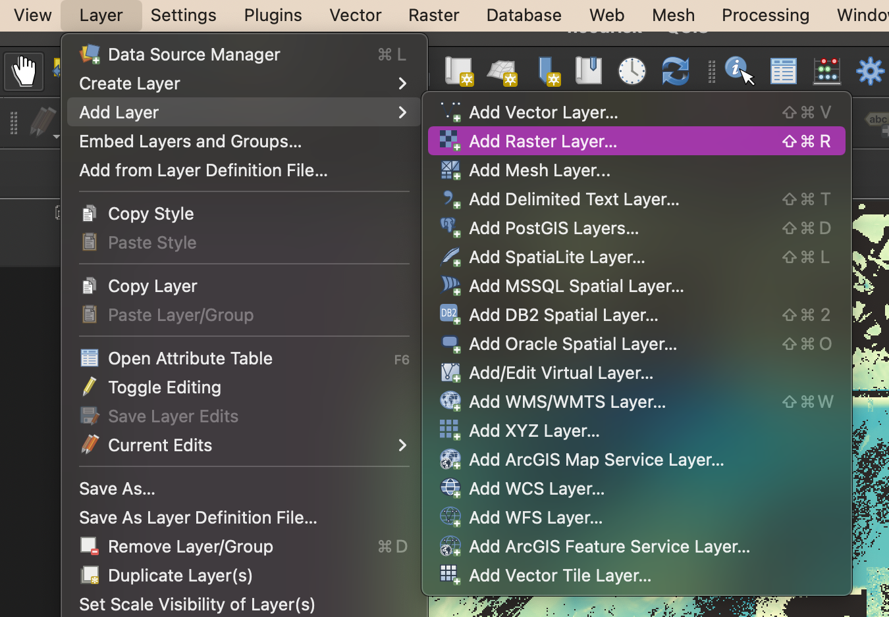

# Mapping geoTIFFs for the web: how was the Miami-Dade flood risk map made? 

## Table of Contents

- [Overview](#overview)
- [Data sources](#data-sources)
- [Working with geoTIFF Files in QGIS](#working-with-geotiff-files-in-qgis)
- [Uploading geoTIFFs to Mapbox as Tilesets](#uploading-geotiffs-to-mapbox-as-tilesets)
- [Using Mapbox Studio to Create a Style Layer](#using-mapbox-studio-to-create-a-style-layer)
- [Creating a Custom Web Map with Mapbox GL JS](#creating-a-custom-map-with-mapbox-gl-js)
- [Add a Toggle Switch](#add-a-toggle-switch)
- [Addendum: Help Me Make This Map More Accessible](#addendum-help-me-make-this-map-accessible)
---

## Overview  

I created the interactive Miami-Dade County flood map seen below was made for [this]() story by [Alex Harris]() in the Miami Herald. It depicts the water depth that each three-meter pixel has the chance of getting within a 5% probability. The map is designed to compare different areas of Miami-Dade County, along with the current projection to the future projection. For that reason, the raw values (originally in centimeters) have been exluded from the map, and the visualization is based on a color gradient scheme.  

This walkthrough assumes beginner-level HTML/CSS/JavaScript knowledge, along with some familiarity with QGIS.

---

## Data Sources/Attribution

- I received the flood data for this map in the form of geoTIFF files via email from [First Street Foundation](https://firststreet.org/). You can find First Street Foundation's full flood-related datasets [here](https://livingatlas.arcgis.com/en/browse/?q=%22First%20Street%22#d=2&q=%22First%20Street%22&type=layers&srt=name). Explore all public data from the foundation [here](https://firststreet.org/data-access/public-access/).
- [Shapefile: TIGER/LINE format on the U.S. county level](https://www.census.gov/geographies/mapping-files/time-series/geo/tiger-line-file.html)
- The toggle switch was coded following a [W3Schools](https://www.w3schools.com/) tutorial. 
---

## Working with geoTIFF Files in QGIS

1. [Upload geoTIFFs to QGIS](#upload-geotiffs-to-qgis)  
2. [Add a shapefile](#add-a-shapefile)
3. [Convert bands to 8-bit](#convert-bands-to-8-bit)
4. [Style raster bands](#style-raster-bands)
5. [Export geoTIFFs](#export-geotiffs)

### **Upload geoTIFFs to QGIS**

- If you don't already have it installed, download and install the long-term release (LTR) version of [QGIS](https://qgis.org/en/site/forusers/download.html).
- Within QGIS, we're going to upload your geoTIFF file(s) as raster layers. If your data file ends in .tif or .tiff, you're looking at the right thing, so long as it contains geo information.
- To each of your files, from the top navigation bar in QGIS, click *Layer > Add layer > Add Raster Layer*. 

- Find the file source within your computer and upload. The layers should now appear in your layers panel.

### **Add a shapefile**

- Your shapefile should be in a *zip* file. From your device's file navigation, you can drag the *zip* file into the QGIS layers panel. Alternatively, use *Layer > Add Layer > Add Vector Layer*.

- Filter your shapefile to your area of interest. You may need to inspect the attribute table to figure out the best way to filter. View the attribute table by right-clicking the layer from the layers panel and select *Open Attribute Table*.

- Once you know how you want to filter your file, right-click the layer again, and click *Filter*, and write your expression. For example, if I wanted to see only Florida within my U.S. file, I would type *"STATE_FP" = '12'*. Be sure to use double quotation marks on the attribute name and single quotation marks on the attribute value.

- A new, temporary layer should be generated of your file. Hide your old file from the map by unchecking it. Save your new file by right-clicking and selecting *Export > Save Feature As*.

- When saving your new file, keep the format as Shapefile, and set your CRS. Select *EPSG:4326 - WGS 84* since we'll be moving the files to Mapbox.

### **Convert bands to 8-bit**

- We're going to upload our raster files to Mapbox. But in order to meet Mapbox's requirements, we must convert our raster bands to 8-bit files.
- From the top navigation bar, click *Raster > Conversion > Translate (Convert Format)*.

- Select your raster file as the *Input layer*.

- Change *Output data type* to *Byte*.

- Leave other settings unchanged. Click *Run*. The new layer should now appear as a temporary layer on your layer panel. You may wish to rename your layers in a way that will assure you remember which one is which.

- Save your new file by right-clicking it in the layers panel and selecting *Export > Save Feature As*.

- When saving your new file, keep the file format as *geoTIFF* and select *EPSG:4326 - WGS 84* for the CRS since we'll be moving the files to Mapbox.

### **Style raster bands**

- Note that these instructions are specific to the data I worked with. They are a good starting point, but you may have to play around with settings and options for your data styling.

- Right-click one of your 8-bit raster layers. Select *Properties*. Click into the *Symbology* tab.

- Set *Rendering type* to *Singleband pseudocolor*.

- Set your color ramps, number of color stops, min/max values, etc. as you want your data to appear. Finding a good color gradient for your map can be one of the lengthiest parts of this process. Be sure to keep color accessibility in mind. [Colorbrewer](https://colorbrewer2.org/#type=sequential&scheme=BuGn&n=3) is a great resource for finding accessible color schemes for maps.

- Repeat this process for any other raster layers. Be sure to use the same styling for each layer if you plan to compare them. If you have several layers, I recommend saving your style file and re-applying it to each layer. You can do this from the bottom of the symbology section. (*Style > Save Style* to save, or *Style > Load style* to load saved style)

### **Export geoTIFFs**

- Right-click your 8-bit, colorized raster file from the layers panel. Select *Export > Save Feature As*.

- Select *Rendered Image* as your output mode. This is important. Further steps will not work if you do not save a rendered image of your data to your computer. 

- Save the file; repeat for any other raster layers.

---

## Uploading geoTIFFs to Mapbox as Tilesets

1. [What is Mapbox, anyway?](#what-is-mapbox-anyway)
2. [Use Mapbox's API to upload large files](#use-mapboxs-api-to-upload-large-files)
3. [Inspect Mapbox Studio tilesets](#inspect-mapbox-studio-tilesets)

### What is Mapbox, anyway?

- We're going to be using Mapbox Studio and Mapbox GL JS, which are two separate tools that work well together. Mapbox Studio is a no-code web mapping service. Some people think of it as the Photoshop of web mapping. It powers much of the maps you see on the web, and allows anyone to create custom, stylish maps that are easy to embed in applications or websites. It has some limitations, though, and that's where Mapbox GL JS comes in. GL JS requires some JavaScript knowledge, but it allows us to add some built-in UI features and, really, just about any kind of interactivity that you can code. We're going to keep things fairly simple. We'll add our map layers dynamically so that we can toggle them on and off with a button we'll make with HTML and CSS. We'll also add a zoom button. Explore the GL JS documentation to see what else you can do.

- Now, [create a Mapbox account](https://www.mapbox.com/mapbox-studio) if you don't already have one.

### **Use Mapbox's API to upload large files**

### **Inspect Mapbox Studio tilesets**

---

## Using Mapbox Studio to Create a Style Layer

1. [What is Mapbox Studio?](#what-is-mapbox-studio)
2. [Create a base layer for your map](#create-a-base-layer-for-your-map)
3. [Add the tilesets (your flood data) and shapefile](#add-the-tilesets-your-flood-data-and-shapefile)
4. [Style text over flood maps](#style-text-over-flood-maps)
5. [Hide flood layers](#hide-flood-layers)
6. [Publish base map](#publish-base-map)

### **What is Mapbox Studio?**

### **Create a base layer for your map**

### **Add the tilesets (your flood data) and shapefile**

### **Style text over flood maps**

### **Hide flood layers**

### **Publish base map**

---

## Creating a Custom Map with Mapbox GL JS

1. [Initalize map](#initialize-map)
2. [Customize user interaction features](#customize-user-interaction-features)
3. [Add flood layers](#add-flood-layers)

### **Initialize map**

### **Customize user interaction features**

### **Add flood layers**

---

## Add a Toggle Switch
1. [Create the switch](#add-a-switch)
2. [Make the switch functional](#make-the-switch-functional)

### **Add a switch**

### **Make the switch functional**

---
## Addendum: Help Me Make This Map Accessible

### Contents

 

